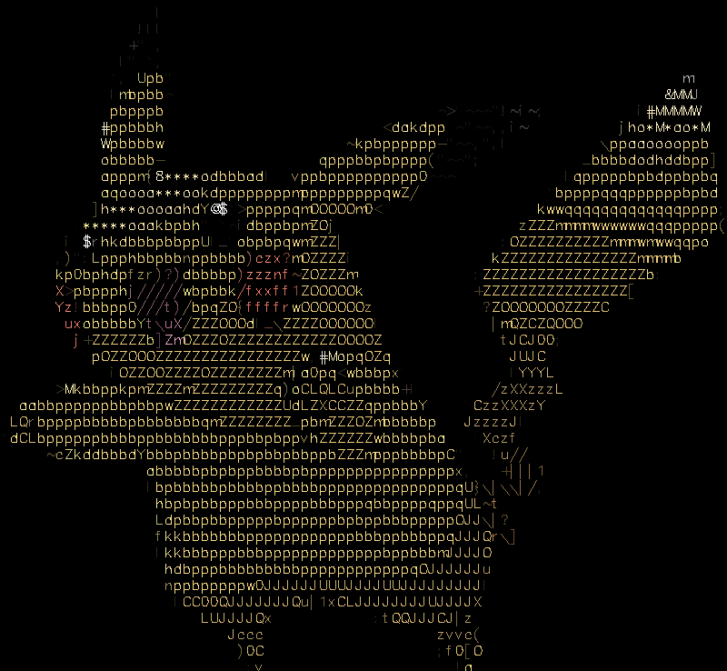
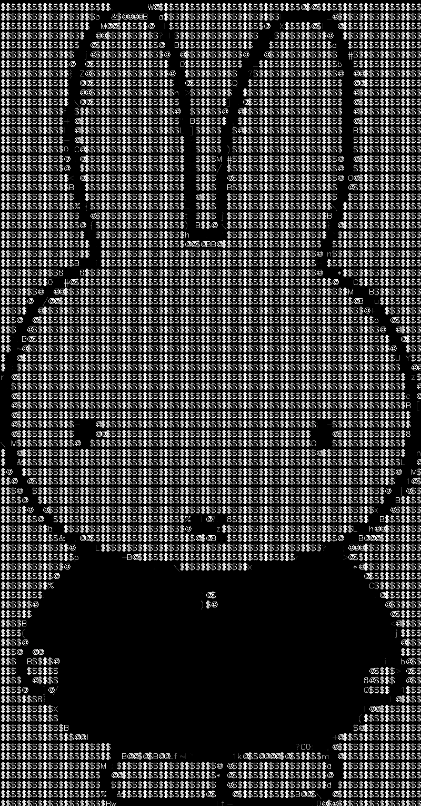

## Usage :clipboard:
```
Pre-req: CMake, C++14, CUDA, MPI, OpenCV (with CUDA support), Python (Optional)
1. Compile with 'make'
2. Usage: 'mpirun -np [INT] (number of processes) ./image_to_ascii -i <FILE> [Options]'
Options:
    -i, --input  <FILE>     Specify the path of the input image filepath (required)
    -o, --output <STRING>   Specify the path of the output file name (e.g. image)
    -w, --width  <INT>      Set the width of the ASCII output; maintains aspect ratio
    -s, --chars  <STRING>   Define the set of characters used in the ASCII output
    -p, --print             Print the ASCII output to the console
    -n, --negate            Create a negative ASCII art
    -f, --factor <FLOAT>    Set the scale factor from 0.1 to 1.0 (default) to resize the image
    -c, --color             Get ASCII PNGs in colors
3. (Optional)Run 'python generateImage.py <num>'
    There are 4 pre-generated images. However, if you wish to use new images (note that existing images will be replaced),
    run this command, but make sure you have an Unsplash API key saved in a .env file.
```

## Examples :eyes:

|                     Input                     |                                 Output                                 |
|-----------------------------------------------|------------------------------------------------------------------------|
|         |                           |
| command:                                      | `mpirun -np 4 ./image_to_ascii -i images/cpp.png -c -w 150`            |
|    |                      |
| command:                                      | `mpirun -np 4 ./image_to_ascii -i images/hwoarang.png -c -w 150`       |
|     |                       |
| command:                                      | `mpirun -np 4 ./image_to_ascii -i images/pikachu.png -c -w 150`        |
|       |                         |
| command:                                      | `mpirun -np 4 ./image_to_ascii -i images/miffy.png -c -w 150`          |
